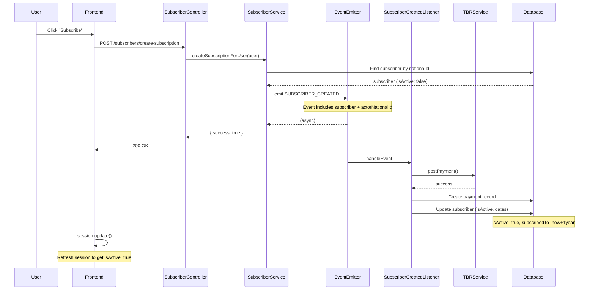

# Plan: TBR Subscription Payment Integration

## Summary

Integrate TBR (Tollur og Bókhald Ríkisins) payment system for Legal Gazette subscriber registrations. When a user subscribes, they are charged an annual subscription fee via TBR.

## Planning Date

December 3, 2025  
**Last Updated:** January 9, 2026

---

## Background

### Current State

- New subscribers are created with `isActive: false` by default
- No payment flow existed for new subscribers (now implemented)
- Subscription activation happens after successful TBR payment request

### Existing TBR Integration

Reference implementation for advert payments:
- [`advert-published.listener.ts`](../../../apps/legal-gazette-api/src/modules/advert/publications/listeners/advert-published.listener.ts)
- [`TBRService`](../../../apps/legal-gazette-api/src/modules/tbr/tbr.service.ts)

### Requirements

- **Fee Amount:** 4,500 ISK annual subscription fee (configurable via env variable)
- **Trigger:** When subscriber initiates subscription purchase
- **Activation:** Set `isActive: true` after successful TBR payment request creation
- **Fee Code:** Configured via `LG_SUBSCRIPTION_FEE_CODE` environment variable (default: `RL401`)

---

## Implementation Plan

### Phase 1: Research & Configuration ✅ Complete

#### 1.1 Determine TBR Fee Codes

- [x] Identify correct fee code for subscription payments (Using `LG_SUBSCRIPTION_FEE_CODE` env var, default `RL401`)
- [x] Identify charge category for subscription payments (Using existing `LG_TBR_CHARGE_CATEGORY_PERSON` and `LG_TBR_CHARGE_CATEGORY_COMPANY`)
- [x] Confirm payment amount (4,500 ISK, configurable via `LG_SUBSCRIPTION_AMOUNT` env var)

#### 1.2 Review Existing TBR Integration

- [x] Understand `TBRService` interface and methods
- [x] Review advert payment flow for reference
- [x] Identify any differences needed for subscription payments

---

### Phase 2: Backend Implementation ✅ Complete

#### 2.1 Create Subscription Payment Service

**✅ Implemented:** Using existing `TBRService` via dependency injection in listener

#### 2.2 Integration Points

**✅ Implemented:** Event-based approach
- [x] Created `SubscriberCreatedEvent` with `actorNationalId` field
- [x] Created `SubscriberCreatedListener` that triggers TBR payment
- [x] Similar pattern to `AdvertPublishedListener`

#### 2.3 Subscriber Activation

**✅ Implemented:** Activation happens in listener after successful payment request creation
- [x] Service emits event (does NOT activate subscriber)
- [x] `SubscriberCreatedListener` calls TBR, saves payment, then updates subscriber
- [x] Sets `isActive: true`, `subscribedTo` (1 year from now)
- [x] Only sets `subscribedFrom` if not already set (preserved on renewals)

#### 2.4 Subscription Date Tracking

**✅ Implemented:** Two-field approach for subscription dates
- `subscribedFrom`: First day of subscription (set once, never updated on renewal)
- `subscribedTo`: Subscription expiry date (always updated on purchase/renewal to now + 1 year)

#### 2.5 Payment Actor Tracking

**✅ Implemented:** Track who initiated the subscription
- [x] Added `activatedByNationalId` field to `SubscriberPaymentModel`
- [x] Uses `actor.nationalId` if delegation exists, otherwise `user.nationalId`
- [x] Supports renewals (no UNIQUE constraint on subscriber_id)

---

### Phase 3: Transaction Boundaries & Robustness ✅ Complete

#### 3.1 Add Transaction Boundaries

**✅ Implemented:** Full transaction handling with three-step flow
- [x] Step 1: Create PENDING transaction record in database BEFORE calling TBR (prevents orphaned TBR claims)
- [x] Step 2: Call TBR API (external call - cannot be rolled back)
- [x] Step 3: Activate subscriber in separate transaction
- [x] Transaction record updated to CREATED on success, FAILED on TBR error
- [x] If DB operations fail after TBR success, logs CRITICAL error for manual intervention

#### 3.2 Error Recovery

- [x] Handle partial failures (TBR succeeds but DB fails) - logs critical error with full context
- [x] Update transaction status to FAILED when TBR call fails
- [ ] Add retry mechanism for transient failures (future enhancement)
- [x] Log all payment attempts for auditing with transaction IDs

---

### Phase 4: Unit Tests ✅ Complete

#### 4.1 Listener Tests

**✅ Fully Implemented:** 23 tests passing
- [x] Fee code lookup by code string
- [x] Fee code not found error handling
- [x] TBR payment creation with correct parameters for personal & company IDs
- [x] TBR payment failure handling
- [x] TBR transaction record creation with correct data
- [x] Subscriber-transaction junction record creation
- [x] Previous transactions marked as not current (supports renewals)
- [x] Actor national ID tracking (delegation support)
- [x] `subscribedFrom` set for new subscription only
- [x] `subscribedFrom` NOT updated for renewal
- [x] `subscribedTo` set to 1 year from now
- [x] DB operations wrapped in transactions
- [x] PENDING transaction record creation before TBR call (C-4 fix)
- [x] Transaction record updated to CREATED after successful TBR
- [x] Transaction record updated to FAILED when TBR fails
- [x] Subscriber NOT activated when TBR fails
- [x] Transaction record persists even if subscriber update fails
- [x] Full flow integration tests (Fee Lookup → TBR Transaction → Junction → TBR API → Activate)
- [x] Renewal flow preserves original `subscribedFrom`

**Test Results**: All 23 tests passing (verified Jan 9, 2026)

---

### Phase 5: Frontend Updates ✅ Complete

#### 5.1 Registration Flow

**✅ Implemented:** Full registration flow in `legal-gazette-public-web`
- [x] Subscription fee information displayed (4,500 kr árleg áskrift)
- [x] Payment notice: "Við skráninguna verður til greiðsluseðill"
- [x] Terms checkbox: "Ég samþykki að greiðsluseðill verði sendur í heimabanka"
- [x] `RegistrationButton` component calls `createSubscription` tRPC mutation
- [x] Form fields show read-only user info (name, nationalId)
- [x] Active subscription check with info alert if already subscribed
- [x] Redirect to home page after successful registration

#### 5.2 Session Refresh

**✅ Implemented:** Session update in `RegistrationButton`
- [x] Calls `update()` from `useSession` after successful subscription
- [x] Session reflects `isActive: true` after update
- [x] Automatic redirect to home page after 1 second

#### 5.3 Error Handling

**✅ Implemented:** Error toast on failure
- [x] Display error toast if mutation fails or returns `success: false`
- [x] Error message: "Villa kom upp við skráningu, vinsamlegast hafið samband við þjónustuver"

---

## Open Questions

1. **✅ Fee Code:** Fee code configured via `LG_SUBSCRIPTION_FEE_CODE` environment variable (default: `RL401`)

2. **✅ Charge Category:** Using existing TBR charge categories for person/company

3. **Payment Confirmation:** Do we need to handle payment confirmation callbacks, or is payment request creation sufficient? _(Currently: activation on request creation)_

4. **Subscription Renewal:** How will annual renewal be handled? _(Now supported - multiple payments per subscriber allowed)_

5. **Refunds:** What happens if a user wants to cancel their subscription? _(Out of scope for this plan)_

6. **TBR advertId field:** The `TBRPostPaymentBodyDto.advertId` is reused for `subscriberId`. Unclear if TBR validates this semantically. _(Left open)_

---

## Dependencies

- TBR service must be configured and accessible
- Fee codes must be set up in TBR system
- AWS credentials for any notification emails

---

## File Summary

### New Files Created

| File | Type | Description | Status |
|------|------|-------------|--------|
| `subscriber-created.event.ts` | Event | Event emitted when subscription is purchased | ✅ Complete |
| `subscriber-created.listener.ts` | Listener | Handles TBR payment and subscriber activation (274 lines) | ✅ Complete |
| `subscriber-created.listener.spec.ts` | Tests | Comprehensive test suite (693 lines, 23 tests) | ✅ Complete |
| `subscriber-transaction.model.ts` | Model | Junction table for subscriber-transaction relationship | ✅ Complete |
| `tbr-transactions.model.ts` | Model | Unified TBR transaction model (adverts & subscriptions) | ✅ Complete |
| `m-20260106-tbr-transaction-consolidation.js` | Migration | Creates unified tbr_transactions and subscriber_transaction tables | ✅ Complete |

### Files Modified

| File | Changes | Status |
|------|---------|--------|
| `constants.ts` | Added `SUBSCRIBER_CREATED` event and `SUBSCRIBER_TRANSACTION` model | ✅ Complete |
| `subscriber.service.ts` | Emit event with actorNationalId, idempotency checks, user lock | ✅ Complete |
| `subscriber.service.spec.ts` | Tests for duplicate prevention (C-3), delegation support | ✅ Complete |
| `subscriber.provider.module.ts` | Register listener and TBR module | ✅ Complete |
| `app.module.ts` | Register `SubscriberTransactionModel` and `TBRTransactionModel` | ✅ Complete |
| `app/skraning/@register/page.tsx` | Show payment info, terms checkbox, registration form | ✅ Complete |
| `RegistrationButton.tsx` | Call mutation, session update, redirect | ✅ Complete |

---

## Status

| Phase | Status | Notes |
|-------|--------|-------|
| Phase 1: Research & Configuration | ✅ Complete | TBR integration reviewed, fee codes configured via env vars |
| Phase 2: Backend Implementation | ✅ Complete | Event-based listener, correct activation flow, renewal support |
| Phase 3: Transaction Boundaries | ✅ Complete | Three-step flow with PENDING → CREATED/FAILED status tracking |
| Phase 4: Unit Tests | ✅ Complete | 23 tests passing, includes C-4 orphaned claims prevention |
| Phase 5: Frontend Updates | ✅ Complete | Full registration flow in legal-gazette-public-web |

## Environment Variables

The following environment variables must be configured:

| Variable | Description | Default | Required |
|----------|-------------|---------|----------|
| `LG_SUBSCRIPTION_FEE_CODE` | TBR fee code for subscriptions | `RL401` | No (uses default) |
| `LG_SUBSCRIPTION_AMOUNT` | Annual subscription fee in ISK | `4500` | No (defaults to 4500) |
| `LG_TBR_CHARGE_CATEGORY_PERSON` | TBR charge category for persons | - | Yes (already exists) |
| `LG_TBR_CHARGE_CATEGORY_COMPANY` | TBR charge category for companies | - | Yes (already exists) |
| `LG_TBR_CREDENTIALS` | TBR API credentials | - | Yes (already exists) |
| `LG_TBR_OFFICE_ID` | TBR office ID | - | Yes (already exists) |
| `LG_TBR_PATH` | TBR API base path | - | Yes (already exists) |

## Implementation Details

### Payment Flow

### Subscription Fields

| Field | Type | Description | Set When |
|-------|------|-------------|----------|
| `isActive` | boolean | Whether subscription is currently active | On successful payment |
| `subscribedFrom` | Date \| null | First day of subscription (preserved on renewal) | On first payment only |
| `subscribedTo` | Date \| null | Subscription expiry date | On every payment (now + 1 year) |

### Transaction Record Fields

**Table: `tbr_transactions`** (unified for adverts and subscriptions)

| Field | Type | Description |
|-------|------|-------------|
| `id` | UUID | Transaction ID |
| `transactionType` | enum | ADVERT or SUBSCRIPTION |
| `feeCodeId` | UUID | Reference to fee code |
| `feeCodeMultiplier` | number | Quantity/multiplier |
| `totalPrice` | number | Total amount in ISK |
| `chargeBase` | string | TBR charge base (advert/subscriber ID) |
| `chargeCategory` | string | TBR category (person vs company) |
| `debtorNationalId` | string | National ID being charged |
| `status` | enum | PENDING, CREATED, FAILED, PAID, CANCELLED |
| `tbrError` | string \| null | Error message if TBR call failed |

**Table: `subscriber_transaction`** (junction table)

| Field | Type | Description |
|-------|------|-------------|
| `subscriberId` | UUID | Reference to subscriber |
| `transactionId` | UUID | Reference to TBR transaction |
| `activatedByNationalId` | string | National ID of actor who purchased (supports delegations) |
| `isCurrent` | boolean | Whether this is the current/active subscription transaction |

---

## Technical Notes

### Actor vs Subscriber

When a user acts on behalf of a company (via Ísland.is delegation):
- `user.nationalId` = company's national ID (the subscriber)
- `user.actor.nationalId` = person's national ID (who is acting)

The `activatedByNationalId` field stores `actor?.nationalId ?? nationalId` to track who actually initiated the purchase.

### Renewal Support

The system now supports subscription renewals:
- Multiple payment records per subscriber (no UNIQUE constraint)
- `subscribedFrom` is preserved (original subscription date)
- `subscribedTo` is updated to now + 1 year on each renewal
- Full payment history is maintained

---

## Testing Checklist

### Backend Tests ✅ Complete

- [x] Listener uses Sequelize transaction for DB operations
- [x] Transaction record creation and subscriber update in separate transactions
- [x] Partial failure handling tested (TBR succeeds but DB fails)
- [x] Error logging captures all payment attempts with transaction IDs
- [x] `SubscriberCreatedListener` creates TBR payment correctly (23 tests)
- [x] `SubscriberCreatedListener` saves transaction with `activatedByNationalId`
- [x] `SubscriberCreatedListener` sets `subscribedFrom` only if null
- [x] `SubscriberCreatedListener` always updates `subscribedTo`
- [x] `SubscriberCreatedListener` handles TBR errors gracefully
- [x] `SubscriberCreatedListener` updates transaction status correctly
- [x] `SubscriberService` does NOT activate subscriber (only emits event)
- [x] `SubscriberService` correctly determines actor nationalId
- [x] Company vs person ID detection using Kennitala library

### Frontend Tests 🔲 Not Started

- [ ] New user registration creates payment and activates subscription
- [ ] Existing subscriber can renew (extends subscribedTo, keeps subscribedFrom)
- [ ] Delegation: actor national ID is correctly tracked
- [ ] Session refresh after subscription shows isActive = true
- [ ] Error states are displayed correctly

**Note:** Frontend functionality is implemented and working, but automated E2E tests not yet created.
