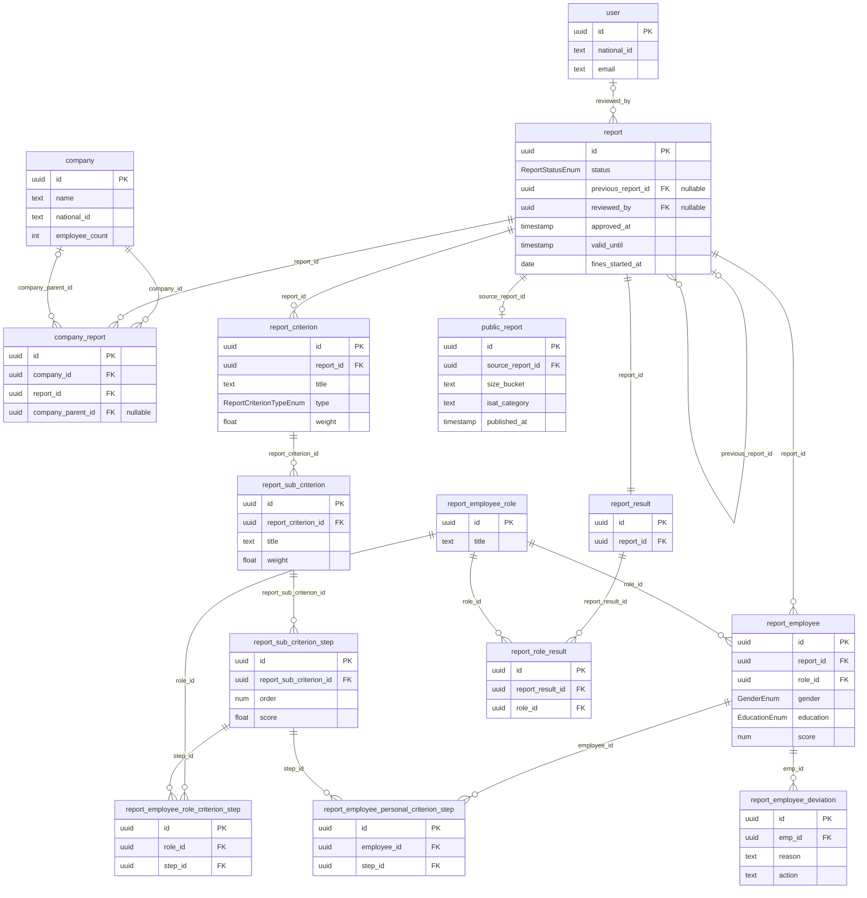

# DoE DB Schema Diagram

Entity-relationship diagram of the DoE salary equality reporting schema. Entities show only PK + FK columns + a few key fields for readability. Full column lists live in [`README.md`](./README.md) under the Tables section.

Relationship labels are the FK column name. Cardinality notation:
- `|o` = zero-or-one (nullable FK)
- `||` = exactly one
- `o{` = zero-or-many

