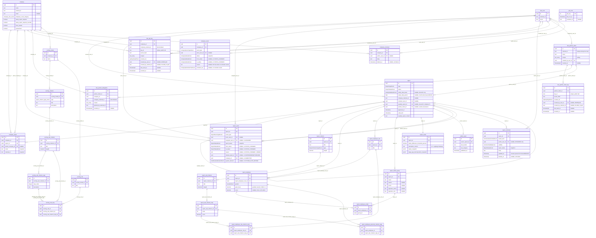

# DoE DB Schema Diagram

Entity-relationship diagram of the DoE salary equality reporting schema. Entities show only PK + FK columns + a few key fields for readability. Full column lists live in [`README.md`](./README.md) under the Tables section.

The `scoring_*` tables are the company-scoped starfsmat the partner API files
against, and they sit **apart from the report graph on purpose**: a filing
materialises its own `report_criterion` / `report_sub_criterion` /
`report_employee_role` rows from a scoring model, and there is no FK from a
report back to the model it came from. That is what lets a company rework its
starfsmat without disturbing a report already filed under the old one — the
report owns a frozen copy, which is also why the scoring model carries no
version.

Relationship labels are the FK column name. Cardinality notation:

- `|o` = zero-or-one (nullable FK)
- `||` = exactly one
- `o{` = zero-or-many

```mermaid
erDiagram
    doe_user {
        uuid id PK
        text national_id
        text email
    }
    company {
        uuid id PK
        text name
        text national_id
        text email "nullable"
        company_size_enum employee_count_category
        boolean salary_report_required
        boolean salary_report_required_override
        boolean fines_started
        boolean quarantined
    }
    company_report {
        uuid id PK
        uuid company_id FK
        uuid report_id FK
        uuid parent_company_id FK "nullable"
        text name "snapshot"
        text national_id "snapshot"
    }
    report {
        uuid id PK
        ReportTypeEnum type
        ReportStatusEnum status
        SalaryDataBasisEnum salary_data_basis "nullable, SALARY only"
        date salary_data_period "nullable, month when basis MONTH"
        text company_national_id "nullable"
        uuid reviewer_user_id FK "nullable"
        uuid equality_report_id FK "nullable, SALARY to EQUALITY"
        uuid partner_client_id FK "nullable, vendor provenance"
        timestamp approved_at
        timestamp valid_until
        text equality_report_content
    }
    report_criterion {
        uuid id PK
        uuid report_id FK
        text title
        ReportCriterionTypeEnum type
        decimal weight
    }
    report_sub_criterion {
        uuid id PK
        uuid report_criterion_id FK
        text title
        decimal weight
    }
    report_sub_criterion_step {
        uuid id PK
        uuid report_sub_criterion_id FK
        int order
        decimal score
    }
    report_employee {
        uuid id PK
        uuid report_id FK
        uuid report_employee_role_id FK
        GenderEnum gender
        decimal paid_hours "greiddar stundir, CHECK > 0"
        decimal score "nullable, NULL until submit"
    }
    report_employee_role {
        uuid id PK
        uuid report_id FK
        text title
    }
    report_outlier_group {
        uuid id PK
        uuid report_id FK
        text name
        text reason "nullable"
        text action "nullable"
        text signature_name "nullable"
        text signature_role "nullable"
    }
    report_employee_outlier {
        uuid id PK
        uuid report_employee_id FK
        uuid group_id FK
    }
    report_employee_role_criterion_step {
        uuid id PK
        uuid report_employee_role_id FK
        uuid report_sub_criterion_step_id FK
    }
    report_employee_personal_criterion_step {
        uuid id PK
        uuid report_employee_id FK
        uuid report_sub_criterion_step_id FK
    }
    report_result {
        uuid id PK
        uuid report_id FK
        decimal salary_difference_threshold_percent
        text calculation_version "v2 = reglulegt tímakaup"
        jsonb salary_snapshot
        jsonb wage_gap_decomposition_snapshot
    }
    public_report {
        uuid id PK
        uuid source_report_id FK
        text size_bucket
        text isat_category
        timestamp published_at
    }
    report_event {
        uuid id PK
        uuid report_id FK
        ReportEventTypeEnum event_type
        uuid actor_user_id FK "nullable"
        uuid assigned_user_id FK "nullable, on ASSIGNED"
        ReportStatusEnum report_status "snapshot"
        ReportStatusEnum from_status "nullable, on STATUS_CHANGED"
        ReportStatusEnum to_status "nullable, on STATUS_CHANGED"
        text reason "nullable, on STATUS_CHANGED→DENIED"
        uuid related_report_id FK "nullable, on SUPERSEDED/WITHDRAWN"
        uuid company_id FK "nullable, on SUBMITTED"
        AutoReviewDecisionEnum system_decision "nullable, on SYSTEM_AUTO_REVIEW"
    }
    report_comment {
        uuid id PK
        uuid report_id FK
        CommentAuthorKindEnum author_kind
        uuid author_user_id FK "nullable, REVIEWER only"
        CommentVisibilityEnum visibility
        ReportStatusEnum report_status "snapshot"
        text body
        timestamp updated_at "unused; present for ParanoidModel fit"
        timestamp deleted_at "nullable, soft delete"
    }
    doe_api_key {
        uuid id PK
        uuid company_id FK
        text company_national_id "denormalised"
        text key_id "unique, public half"
        text secret_hash
        text_array scopes
        ApiKeyOriginEnum created_via
        uuid created_by_user_id FK "nullable, ADMIN path"
        text created_by_national_id "nullable, ISLAND_IS path"
        timestamptz last_used_at "nullable"
        timestamptz revoked_at "nullable"
    }
    doe_partner_client {
        uuid id PK
        text national_id "unique among live rows"
        text name
        text_array scopes "ceiling"
        uuid created_by_user_id FK
        timestamptz revoked_at "nullable"
    }
    doe_partner_client_key {
        uuid id PK
        uuid partner_client_id FK
        text key_id "unique, public half"
        text secret_hash
        ApiKeyOriginEnum created_via
        uuid created_by_user_id FK "nullable, ADMIN path"
        text created_by_national_id "nullable, ISLAND_IS path"
        timestamptz last_used_at "nullable"
        timestamptz revoked_at "nullable"
    }
    doe_partner_delegation {
        uuid id PK
        uuid partner_client_id FK
        uuid company_id FK
        text company_national_id "denormalised"
        text_array scopes
        text granted_by_national_id
        timestamptz revoked_at "nullable"
    }
    company_event {
        uuid id PK
        uuid company_id FK
        CompanyEventTypeEnum event_type
        uuid actor_user_id FK "nullable"
        CompanyStatusEnum status "snapshot"
        CompanyStatusEnum from_status "nullable, on STATUS_CHANGED"
        CompanyStatusEnum to_status "nullable, on STATUS_CHANGED"
        text reason "nullable; ISO due date on reminder events"
        CompanyReminderTierEnum reminder_tier "nullable, on reminder events"
    }
    company_comment {
        uuid id PK
        uuid company_id FK
        uuid author_user_id FK "nullable"
        text body
        timestamp deleted_at "nullable, soft delete"
    }
    job_runs {
        int job_key PK
        timestamp last_run_at
        text container_id "nullable"
    }

    scoring_model {
        uuid id PK
        uuid company_id FK
        text name
    }
    scoring_criterion {
        uuid id PK
        uuid scoring_model_id FK
        report_criterion_type_enum type
        text title
        text description
    }
    scoring_sub_criterion {
        uuid id PK
        uuid scoring_criterion_id FK
        text title
        numeric weight
    }
    scoring_sub_criterion_step {
        uuid id PK
        uuid scoring_sub_criterion_id FK
        integer step_order
        text description
    }
    scoring_role {
        uuid id PK
        uuid scoring_model_id FK
        text title
    }
    scoring_role_step {
        uuid id PK
        uuid scoring_role_id FK
        uuid scoring_sub_criterion_id FK
        uuid scoring_sub_criterion_step_id FK
    }

    company ||--o{ company_report : "company_id"
    report ||--o{ company_report : "report_id"
    company |o--o{ company_report : "parent_company_id"

    doe_user |o--o{ report : "reviewer_user_id"
    report |o--o{ report : "equality_report_id"

    report ||--o{ report_criterion : "report_id"
    report_criterion ||--o{ report_sub_criterion : "report_criterion_id"
    report_sub_criterion ||--o{ report_sub_criterion_step : "report_sub_criterion_id"

    report ||--o{ report_employee : "report_id"
    report ||--o{ report_employee_role : "report_id"
    report_employee_role ||--o{ report_employee : "report_employee_role_id"
    report_employee ||--o{ report_employee_outlier : "report_employee_id"
    report ||--o{ report_outlier_group : "report_id"
    report_outlier_group ||--o{ report_employee_outlier : "group_id"

    report_employee_role ||--o{ report_employee_role_criterion_step : "report_employee_role_id"
    report_sub_criterion_step ||--o{ report_employee_role_criterion_step : "report_sub_criterion_step_id"

    report_employee ||--o{ report_employee_personal_criterion_step : "report_employee_id"
    report_sub_criterion_step ||--o{ report_employee_personal_criterion_step : "report_sub_criterion_step_id"

    report ||--|| report_result : "report_id"

    report ||--o| public_report : "source_report_id"

    report ||--o{ report_event : "report_id"
    doe_user |o--o{ report_event : "actor_user_id"
    doe_user |o--o{ report_event : "assigned_user_id"
    report |o--o{ report_event : "related_report_id"
    company |o--o{ report_event : "company_id"

    report ||--o{ report_comment : "report_id"
    doe_user |o--o{ report_comment : "author_user_id"

    company ||--o{ doe_api_key : "company_id"
    doe_user |o--o{ doe_api_key : "created_by_user_id"
    doe_user |o--o{ doe_api_key : "revoked_by_user_id"
    doe_partner_client ||--o{ doe_partner_client_key : "partner_client_id"
    doe_partner_client ||--o{ doe_partner_delegation : "partner_client_id"
    company ||--o{ doe_partner_delegation : "company_id"
    doe_partner_client |o--o{ report : "partner_client_id"
    doe_user ||--o{ doe_partner_client : "created_by_user_id"
    company ||--o{ company_event : "company_id"
    doe_user |o--o{ company_event : "actor_user_id"
    company ||--o{ company_comment : "company_id"
    doe_user |o--o{ company_comment : "author_user_id"

    company ||--o{ scoring_model : "company_id"
    scoring_model ||--o{ scoring_criterion : "scoring_model_id"
    scoring_criterion ||--o{ scoring_sub_criterion : "scoring_criterion_id"
    scoring_sub_criterion ||--o{ scoring_sub_criterion_step : "scoring_sub_criterion_id"
    scoring_model ||--o{ scoring_role : "scoring_model_id"
    scoring_role ||--o{ scoring_role_step : "scoring_role_id"
    scoring_sub_criterion ||--o{ scoring_role_step : "scoring_sub_criterion_id"
    scoring_sub_criterion_step ||--o{ scoring_role_step : "(scoring_sub_criterion_step_id, scoring_sub_criterion_id)"
```
